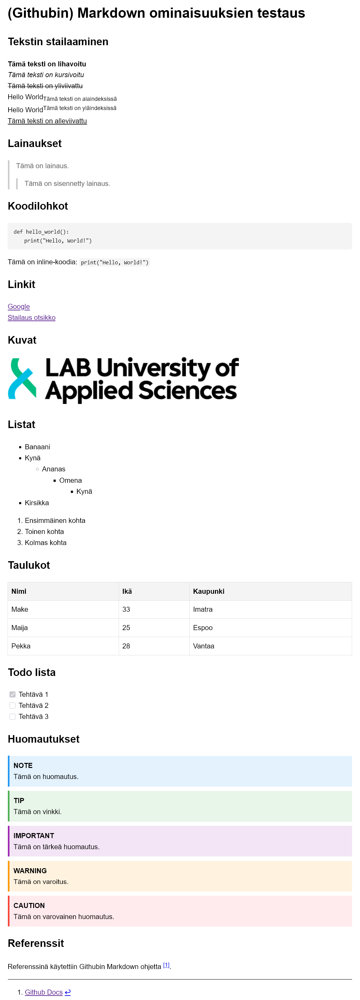

# (Githubin) Markdown ominaisuuksien testaus


## Tekstin stailaaminen

**Tämä teksti on lihavoitu**  
*Tämä teksti on kursivoitu*  
~~Tämä teksti on yliviivattu~~  
Hello World<sub>Tämä teksti on alaindeksissä</sub>  
Hello World<sup>Tämä teksti on yläindeksissä</sup>  
<ins>Tämä teksti on alleviivattu</ins>

## Lainaukset
> Tämä on lainaus.
>> Tämä on sisennetty lainaus.

## Koodilohkot

```python
def hello_world():
    print("Hello, World!")
```
Tämä on inline-koodia: `print("Hello, World!")`

## Linkit  
[Google](https://www.google.com)  
[Stailaus otsikko](#tekstin-stailaaminen)

## Kuvat


## Listat
- Banaani
- Kynä
  - Ananas
    - Omena
      - Kynä
- Kirsikka

1. Ensimmäinen kohta
2. Toinen kohta
3. Kolmas kohta

## Taulukot
| Nimi     | Ikä | Kaupunki    |
|----------|-----|-------------|
| Make    | 33  | Imatra    |
| Maija    | 25  | Espoo       |
| Pekka    | 28  | Vantaa      |

## Todo lista
- [x] Tehtävä 1
- [ ] Tehtävä 2
- [ ] Tehtävä 3

## Huomautukset
>[!NOTE]
>Tämä on huomautus.

>[!TIP]
>Tämä on vinkki.

>[!IMPORTANT]
>Tämä on tärkeä huomautus.

>[!WARNING]
>Tämä on varoitus.

>[!CAUTION]
>Tämä on varovainen huomautus.

<!-- Tämä on kommentti, joka ei näy renderöidyssä Markdownissa -->

## HTML kuva
<details>
<summary>Napsauta nähdäksesi kuvan</summary>


</details>

## Referenssit
Referenssinä käytettiin Githubin Markdown ohjetta [^1].

[^1]: [Github Docs](https://docs.github.com/en/get-started/writing-on-github/getting-started-with-writing-and-formatting-on-github/basic-writing-and-formatting-syntax)
