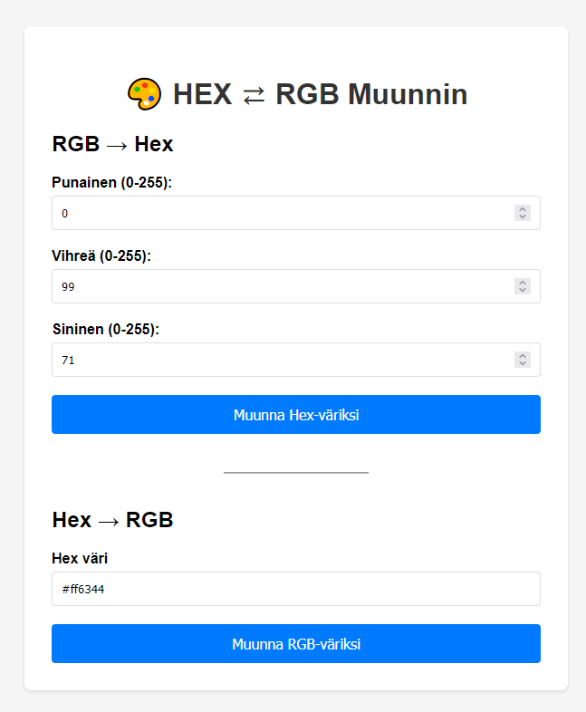
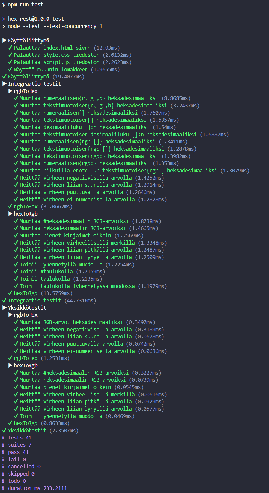

### Hex to RGB muunnin

## Kuvaus
Yksinkertainen web-sovellus, joka muuntaa Hex-värikoodit RGB-muotoon ja päinvastoin.  
Käyttäjä voi syöttää joko Hex- tai RGB-värin, ja sovellus näyttää vastaavan värin sekä sen esikatselun.

## Vaatimukset
- Node.js (v24 tai uudempi)

## Käytetyt kirjastot
- express: Web-palvelimen luomiseen.
- eslint: Koodin laadun varmistamiseen.(dev)
- supertest: API-testaukseen.(dev)
- node:test && node:assert: Testien suorittaminen

## Käyttöohjeet
Kloonaa tai lataa tämä repositorio.   
Asenna riippuvuudet komennolla:
```node
npm install
```
Suorita express-serveri komennolla:
```node
npm start
```
Automaattisesti päivittyvää kehityspalvelinta varten käytä komentoa:
```node
npm run dev
```

Avaa selain ja mene osoitteeseen `http://localhost:3000`  


## Konfigurointi
Määrittele PORT muuttuja .env tiedostossa tai ympäristömuuttujissa, sovellus käyttää oletuksena porttia 3000.  
Produktioympäristö lataa automaattisesti .env tiedoston, kehitysympäristö käyttää .dev.env tiedostoa.  

## Projektin rakenne
```
├── controllers/
│   └── rgbRoute.js       # API-reititykset
├── public/
│   ├── index.html        # Käyttöliittymä
│   ├── style.css         # Tyylit
│   └── script.js         # Frontend-logiikka
├── requests/
│   └── test.rest         # REST Client testit
├── test/
│   ├── unit.test.js      # Yksikkötestit
│   └── route.test.js     # Integraatiotestit
├── utils/
│   └── hex.js            # Muunnosfunktiot
├── app.js                # Express-sovellus
└── server.js             # Palvelimen käynnistys
```

## API Rajapinnat
Sovellus tarjoaa kaksi päätepistettä värimuunnoksiin:

### POST /api/toRGB
Muuntaa HEX-värikoodin RGB-väriksi.
- **Pyyntökeho**: `{ "hex": "#FF6347" }`
- **Vastauskeho**: `{ "r": 255, "g": 99, "b": 71 }`
- **Tuetut muodot**:
  - `{ "hex": "#FF6347" }`
  - `{ "hex": "FF6347" }`
  - `{ "hex": "#FFF" }`
  - `["#FF6347"]`


### Virhevastaukset
- **400 Bad Request**: Virheellinen syöte
  - Esimerkki: `{ "error": "Virheellinen HEX-värikoodi" }`

### POST /api/toHex
Muuntaa RGB-värin HEX-värikoodiksi.
- **Pyyntökeho**: `{ "r": 255, "g": 99, "b": 71 }`
- **Vastauskeho**: `{ "hex": "#ff6347" }`
- **Tuetut muodot**:
  - `{ "r": 255, "g": 99, "b": 71 }`
  - `{ "r": "255", "g": "99", "b": "71" }`
  - `[255, 99, 71]`
  - `["255", "99", "71"]`
  - `{ "rgb": [255, 99, 71] }`
  - `{ "rgb": "255,99,71" }`
  - `{ "rgb": 255099071 }`
  - `{ "rgb": "255099071" }`
  - `[255099071]`
  - `["255099071"]`

### Virhevastaukset
- **400 Bad Request**: Virheellinen syöte
  - Esimerkki: `{ "error": "RGB-arvojen tulee olla välillä 0-255" }`

Kansio requests sisältää API-testejä joita voit suorittaa VSCoden Rest Client laajennuksella. 

## Testaus  
Sovelluksessa on yksikkö- ja integraatiotestit värimuunnosten oikeellisuuden varmistamiseksi.  
Testit käyttävät supertest ja Node.js assert kirjastoa.  

Testit löytyvät kansiosta `test/`.  
### Yksikkötestit (`test/unit.test.js`)
- Testaa `rgbToHex()` ja `hexToRgb()` funktioita
- Validoi virheenkäsittelyn

### Integraatiotestit (`test/route.test.js`)
- Testaa käyttöliittymän latautumisen
- Testaa API-päätepisteet
- Testaa kaikki tuetut syötemuodot

Suorita testit komennolla:
```node
npm test
```

Esimerkkitulokset testeistä:  
