# Verkkokauppa.com UI testaus

### Sisällysluettelo
- [Devtools](#devtools)
  - [Testisivu](#testisivu)
  - [Testiympäristö](#testiympäristö)
  - [Testattavat asiat](#testattavat-asiat)
  - [Tulokset](#tulokset)
- [Selenium](#selenium)
  - [Käytetty teknologia](#käytetty-teknologia)
  - [Testitapaukset](#testitapaukset)
  - [Testien suorittaminen](#testien-suorittaminen)
  - [Ajon Tulokset](#ajon-tulokset)

# Devtools


## Testisivu
- [Verkkokauppa.com etusivu](https://www.verkkokauppa.com/)


## Testiympäristö
- Google Chrome selaimen DevTools
- Emuloitu laite: Samsung Galaxy S20 Ultra
- Verkkoyhteyden presetti: 3G, Disable cache
- Prosessorin hidastus: 20x slowdown

## Testattavat asiat
- Sivun latausaika ja järjestys
- Kuvien koot, placeholderit ja sijoitus
- Navigointi/interaktiivisuus + interaktiivisuus latauksen aikana
- UI skaalautuvuus eri resoluutioilla
- Sivun lataustilan ilmoittaminen käyttäjälle
- Sivun priorisointi (näkyvien elementtien lataaminen ensin)
- Layout shiftit
- Blockaavat elementit

## Tulokset

### Sivuston toteutus
Sivusto näyttää käyttävän Reactia. Etusivua ladatessa havaittiin, että selain lähettää useita kymmeniä GET pyyntöjä javascript tiedostoille. Tarkemmman tutkimisen jälkeen havaittiin, että useat näistä tiedostoista olivat varsin pieniä. Ladattujen skriptien tarkempi tutkiminen paljastaakin, että koodi on jaettu useaan osaan (code splitting) mikä mahdollistaa vain tarvittavien skriptien lataamisen kerralla.  
Tämä on mahdollisesti toteutettu käyttämällä `@loadable/component`-kirjastoa. Ensikokemus on että  sivuston optimointiin selvästi panostettu.  
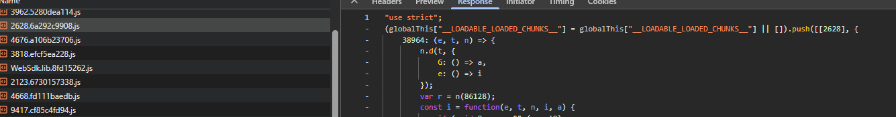  


### Etusivun lataaminen
Etusivu latautui hitasti kuten voisi olettaakkin näillä asetuksilla.  
Latausjärjestys vaikutti loogiselta, pääosin sivu latasi fontit ja skriptit ensin ja viimeisenä kuvat, muutamaa poikkeusta lukuunottamatta.  
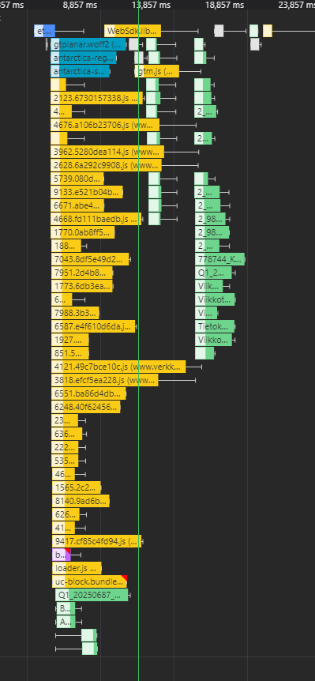  
Sivusto myös priorisoi näkyvien elementttien lataamisen ja jätti skrollauksen takana olevien elementtien lataamisen myöhemmäksi. Ennen kuvien ilmestymistä niiden tilalla näkyi varsin neutraali harmaa placeholder, joka ei häirinnyt käyttäjäkokemusta.  

### Kuvien koot
Kaikki ladatut kuvat näyttävät olevan optimoituja mobiililaitteille (jpg, webp, avif), eikä suuria kuvia ladattu hidastamaan sivun latausta. Kuvien koko ja resoluutio vaikuttivat sopivilta mobiililaitteelle. Suurin tällä kertaa havaittu kuva oli varsin maltillinen 165kB. Tallennetun datan perusteella kuvien koosta voisi säästää 470 kB, mikä on aika merkityksetön määrä.  
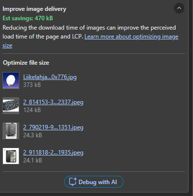


### Layout shiftit
Tallennetun datan perusteella layoutshift tapahtui, mutta kyseessä oli kuitenkin hampurilaisvalikon sisäiset elementit, mitkä eivät ole näkyvissä ennen kuin valikko avataan, joten näillä ei ollut mitään vaikutusta käyttäjäkokemukseen. Yllättäen tämä onkin tallennetussa datassa ainut havaittu layout shift.  
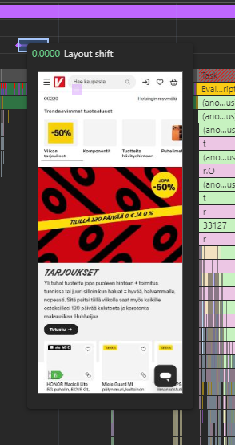
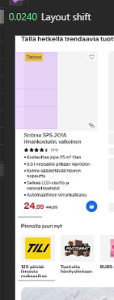


### Navigointi
Rullatessa takaisin sivun alkuun kestää joskus kestää hetken aikaa ennen kuin hampurilaisvalikko ja yläpalkki ilmestyvät. 
Sivua ladatessa latauksen tila ilmoitetaan `Ladataan...` tekstillä.  
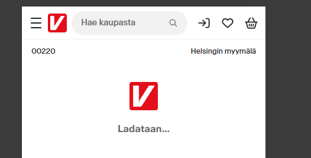  
Tuotteiden määrän latautumisessa näyttää kestävän pitkän aikaa, mutta latauksen tilan hyvin ilmoitettu.  
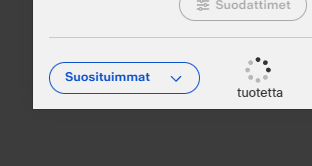  
Hampurilaisvalikon alaketegorioilla oli jokaisella oma latausilmoituksensa, joka näkyi ennen kuin alavalikko avautui.  
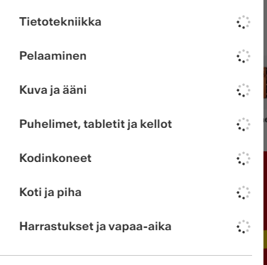  
Karusellivalikot tuntuivat toimivan vaikkei kuvat olleetkaan vielä latautuneet.  
Tuotteiden järjestäminen hinnan mukaan toimi hyvin, mutta latauksen edistymisestä/tapahtumisesta ei ollut ilmoitusta. Järjestäminen kuitenkin tuntui sujuvan kohtalaisen nopeasti verrattuna siihen miten hitaasti esim etusivu latautui hidastetulla prosessorilla, joten se vaikutti olevan toteutettu tehokkaasti.


### Responsiivisuus
Sivusto vaikutti olevan hyvin responsiivinen, ja hyvin suunniteltu mobiililaitteille. Kaikki elementit skaalautuivat hyvin eri resoluutioilla, eikä layout shifttejä havaittu. Navigointi oli sujuvaa ja kaikki toiminnot olivat käytettävissä ilman ongelmia.


### Blockaavat elementit
Eväste banneri latautui viimeisenä, mutta se ei estänyt sivun käyttöä ennen kuin se ilmestyi.  
Ei havaittavissa mitään merkittäviä blockaavia elementtejä tallennetusta datasta eikä käyttäjäkokemuksessa.  

# Selenium

## Käytetty teknologia
- Python
- Selenium
- WebDriver Manager
- pytest

## Testitapaukset
1. Avaa Verkkokauppa.com etusivu, tarkista että sivu latautuu onnistuneesti.
2. Hyväksy evästeet, tarkista että evästeiden hyväksymispainike löytyy ja häviää klikkauksen jälkeen.
3. Etsi hakukenttä, syötä hakusana "peruna" ja suorita haku. Odota että hakutulokset latautuvat, tarkista että tuloksia löytyy.
4. Järjestä hakutulokset hinnan mukaan nousevaan järjestykseen, varmista että järjestys muuttuu ja formaatti on oikein
5. Valitse ensimmäinen tuote hakutuloksista, tarkista että tuotteen sivu latautuu onnistuneesti.
6. Lisää tuote ostoskoriin, tarkista että tuote on lisätty onnistuneesti ja määrä on oikea.

## Testien suorittaminen

Käyttämällä pip
```
python -m venv .venv

# Linux / macOS
source .venv/bin/activate
# Windows (PowerShell)
.venv\Scripts\activate

pip install -e .
test
```

Käyttämällä uv
```
uv run test
```

## Ajon tulokset

Kuten voisi olettaakkin kaikki testitapaukset suoritettiin onnistuneesti ilman virheitä.  
Kaikista testeistä otetaan kuvat, jotka tallennetaan `img`-kansioon nimillä `testX_Y.png` missä X on testitapauksen numero ja Y on testin vaihe.  


### Etusivu
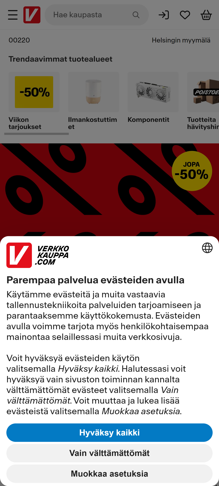

### Evästeet

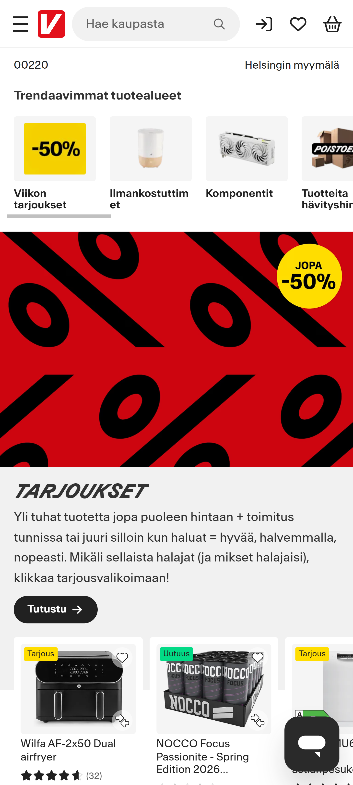

### Haku


### Järjestäminen
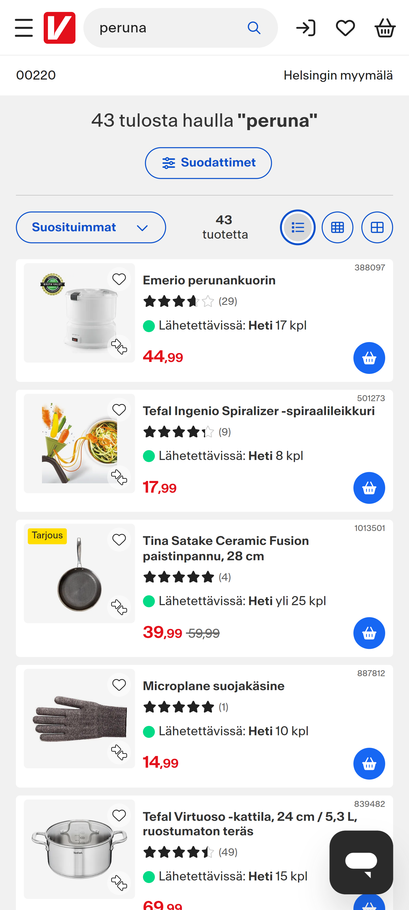
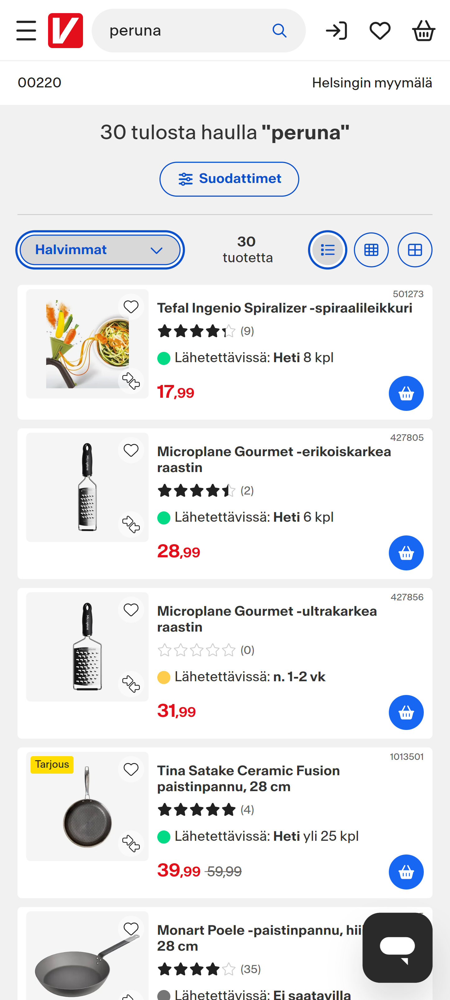

### Tuotesivu
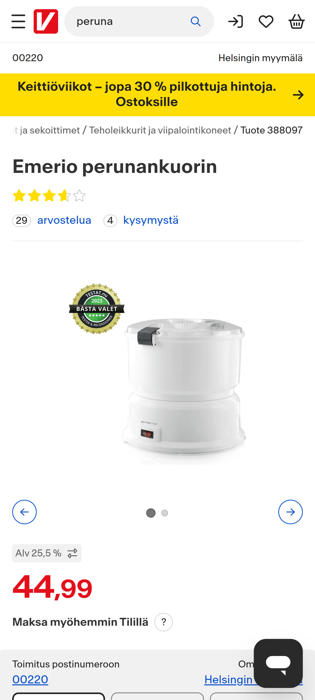

### Ostoskori
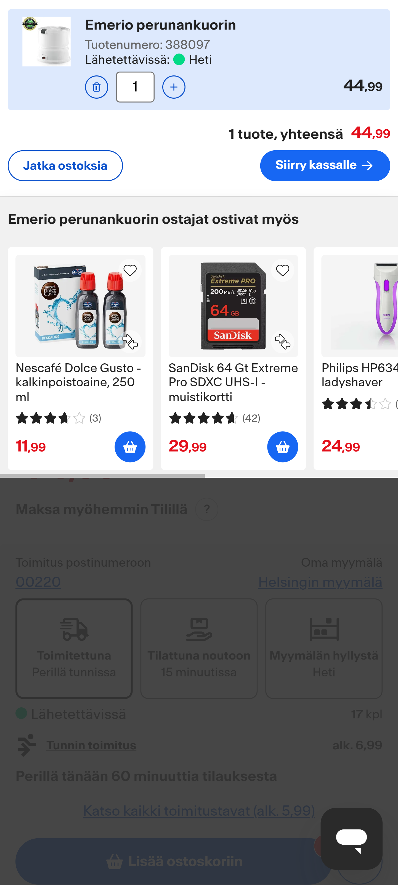

