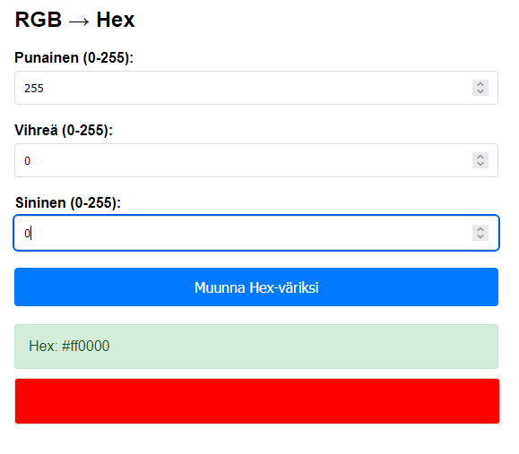
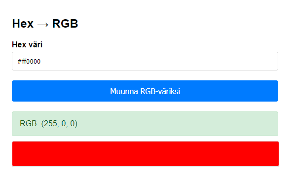
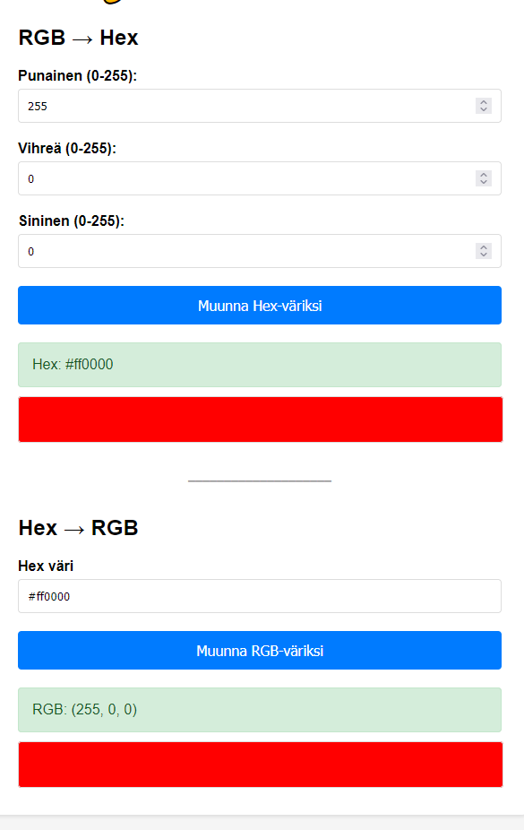
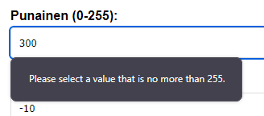
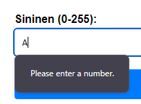
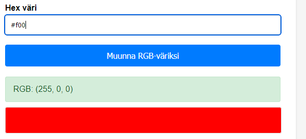
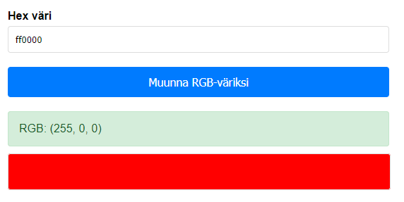
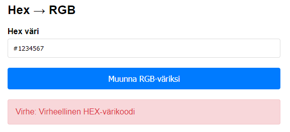
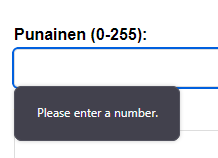
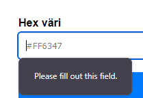

# WEB GUI Testing

## Kuvat sovelluksesta
  

## Testitapaukset
1. RGB -> Hex
2. Hex -> RGB
3. Liian korkea ja matala RGB-arvo
4. Kirjaimia RGB-arvoissa
5. Lyhennetty Hex-koodi
6. Hex ilman #
7. liian pitkä Hex-koodi
8. Hex-koodi jossa on ei-hex-kirjaimia
9. Tyhjä RGB-syöte
10. Tyhjä Hex-syöte

Backendi hyväksyy RGB/Hex syötteitä muissakin muodoissa, mutta frontissa ei ole keinoja syöttää näitä muotoja.

## Odotetut tulokset

| Testi | RGB-syöte | Hex-syöte | Odotettu tulos | Testitulos |
|--|:-:|:-:|:-:|:-:|
|#1| RGB (255, 0, 0) | | #ff0000 | PASS |
|#2| | Hex #00FF00 | RGB (0, 255, 0) | PASS |
|#3| RGB (300, -10, 0) | | Virheilmoitus | PASS |
|#4| RGB (255, 0, A) | | Virheilmoitus | PASS |
|#5| | Hex #F00 | RGB (255, 0, 0) | PASS |
|#6| | Hex 00FF00 | RGB (0, 255, 0) | PASS |
|#7| | Hex #1234567 | Virheilmoitus | PASS |
|#8| | Hex #GGHHII | Virheilmoitus | PASS |
|#9| - | | Virheilmoitus | PASS |
|#10| | - | Virheilmoitus | PASS |  

## Testitulokset
HTML5:n input-typet rajoittavat syötteitä mukavasti, ja vain muutamat virheelliset syötteet pääsivät frontin validoinnin läpi. Backend käsitteli nämä virheelliset syötteet odotetusti, ja kaikki testitapaukset onnistuivat.

### Testi1 & Testi2

### Testi3
Virheilmoitus: "Please select a value that is no more than 255 / no less than 0", tarkka virheviesti riippuu selaimesta ja kielestä.  
  

### Testi4
Virheilmoitus: "Please enter a number", tarkka virheviesti riippuu selaimesta ja kielestä.  
  

### Testi5
Sovellus hyväksyy lyhennetyn Hex-koodin ja muuntaa sen RGB-muotoon.  

### Testi6
Sovellus hyväksyy Hex-koodin ilman # ja muuntaa sen RGB-muotoon.  

### Testi7 & Testi8
Virheilmoitus: "Virhe: Virheellinen HEX-värikoodi", nyt pääsimme frontin validoinnin läpi, joten backend antaa oman virheilmoituksensa.  

### Testi9 & Testi10
  
  