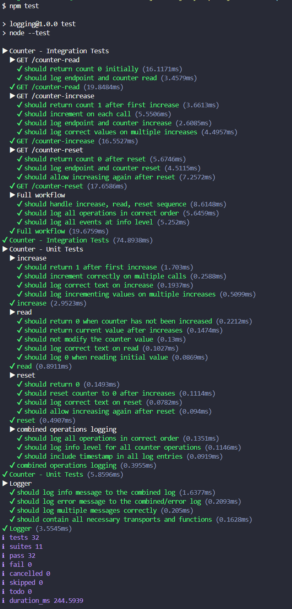

# Counter API - Lokitus

### Sisällysluettelo
- [Yleiskuvaus](#yleiskuvaus)
- [Teknologiat](#teknologiat)
- [Projektin rakenne](#projektin-rakenne)
- [Asennus ja käynnistys](#asennus-ja-käynnistys)
- [API-rajapinta](#api-rajapinta)
  - [GET /counter-increase](#get-counter-increase)
  - [GET /counter-read](#get-counter-read)
  - [GET /counter-reset](#get-counter-reset)
- [Lokitus](#lokitus)
  - [Winston-konfiguraatio](#winston-konfiguraatio)
  - [Lokitiedostot](#lokitiedostot)
  - [Lokitapahtumat](#lokitapahtumat)
- [Testaus](#testaus)
  - [Testien suorittaminen](#testien-suorittaminen)
  - [Testitapaukset](#testitapaukset)
- [Linttaus](#linttaus)

# Yleiskuvaus

Yksinkertainen Express-pohjainen Counter API, joka tarjoaa laskurin kasvattamisen, lukemisen ja nollaamisen HTTP-rajapinnan kautta. Sovellus hyödyntää Winston-kirjastoa lokitukseen ja kirjoittaa lokitapahtumat sekä konsoliin että tiedostoihin.

Projekti sisältää myös minimaalisen HTML-etusivun, josta laskuria voi käyttää selaimessa.

# Teknologiat

- **Node.js** v24.6.0 - Suoritusympäristö
- **Express 5** v5.2.1 - HTTP-palvelinkehys
- **Winston** v3.19.0 - Lokituskirjasto
- **Node.js Test Runner** - Testikehys (sisäänrakennettu)
- **Supertest** v7.2.2 - HTTP-integraatiotestaus
- **ESLint** v10.0.2 - Koodin laadunvarmistus

# Projektin rakenne

```
├── eslint.config.js        # ESLint-konfiguraatio
├── package.json
├── logs/
│   ├── combined.log        # Kaikki lokitapahtumat (info+)
│   └── error.log           # Virhelokitapahtumat
├── src/
│   ├── app.js              # Express-sovelluksen konfigurointi
│   ├── counter.js          # Laskurimoduuli (increase, read, reset)
│   ├── index.html          # Minimaalinen etusivu
│   ├── logger.js           # Winston-loggerin konfigurointi
│   ├── main.js             # Sovelluksen käynnistys
│   ├── middlware.js        # Request-lokitus middleware
│   └── routes.js           # API-reitit
└── tests/
    ├── helpers/
    │   └── LogCapture.js            # Lokitulosteen kaappausapuluokka
    ├── counter.integration.test.js  # Laskurin integraatiotestit (supertest)
    ├── counter.test.js              # Laskurin yksikkötestit
    ├── logger.test.js               # Loggerin yksikkötestit
    └── test.rest                    # REST-testaustiedosto
```

# Asennus ja käynnistys

```bash
# Asenna riippuvuudet
npm install

# Käynnistä palvelin (portti 3000)
npm start
```

Palvelin käynnistyy oletuksena osoitteeseen `http://localhost:3000`.  
Porttia voi muuttaa ympäristömuuttujalla:
```bash
PORT=8080 npm start
```

# API-rajapinta

Kaikki endpointit palauttavat JSON-vastauksen muodossa `{ "count": number }`.

* GET /counter-increase
  * Kasvattaa laskuria yhdellä ja palauttaa uuden arvon.
* GET /counter-read
  * Palauttaa laskurin nykyisen arvon muuttamatta sitä.
* GET /counter-reset
  * Nollaa laskurin ja palauttaa arvon 0.

# Lokitus

## Winston-konfiguraatio

Logger on konfiguroitu Winstonilla tasolla `info` ja käyttää JSON-muotoilua aikaleimoineen. Lokitapahtumat ohjataan kolmeen kohteeseen:

| Transport  | Tiedosto               | Taso    | Kuvaus                               |
|------------|------------------------|---------|--------------------------------------|
| Console    | -                      | info    | Kaikki tapahtumat konsoliin          |
| File       | `logs/error.log`       | error   | Vain virhetapahtumat                 |
| File       | `logs/combined.log`    | info    | Kaikki tapahtumat tiedostoon         |

## Lokitiedostot

Lokitiedostot sijaitsevat `logs/`-kansiossa:
- **combined.log** – Sisältää kaikki lokitapahtumat (info ja error)
- **error.log** – Sisältää vain virhetason tapahtumat

Lokitapahtumat tallennetaan JSON-muodossa aikaleimalla:
```json
{"level":"info","message":"[MAIN] Starting","timestamp":"2026-03-04T15:09:46.325Z"}
```

## Lokitapahtumat

Sovellus lokittaa seuraavat tapahtumat:

| Tapahtuma              | Taso  | Viesti                                |
|------------------------|-------|---------------------------------------|
| Palvelimen tapahtumat  | info  | `[MAIN] <Tapahtuma>`                  |
| HTTP-pyyntö            | info  | `[ENDPOINT] <METODI> <url>`     |
| Laskurin operaatiot    | info  | `[COUNTER] <operaatio> <arvo>`        |

# Testaus

## Testien suorittaminen

```bash
npm test
```

Testit käyttävät Node.js:n sisäänrakennettua testirunner-moduulia (`node --test`).

## Testitapaukset

<details><summary>

### Kuvana
</summary>


</details>
<br>


Kaikki testit käyttävät `LogCapture`-apuluokkaa (`tests/helpers/LogCapture.js`), joka
hiljentää Winstonin oletustransportit ja ohjaa lokitulosteen muistipuskuriin.
Tämä estää lokitiedostoihin kirjoittamisen testien aikana ja tarjoaa käteviä
apufunktioita lokitapahtumien tarkistamiseen.

### Logger-testit (`tests/logger.test.js`)

1. **Info-viesti kirjoitetaan combined-lokiin** – Varmistaa, että info-tason viesti näkyy combined-logissa mutta ei error-logissa.
2. **Error-viesti kirjoitetaan molempiin lokeihin** – Varmistaa, että virheviesti näkyy sekä error- että combined-logissa.
3. **Useat viestit lokitetaan oikein** – Varmistaa, että useampi lokitapahtuma kirjataan oikeassa järjestyksessä oikeisiin kohteisiin.
4. **Logger sisältää tarvittavat transportit ja funktiot** – Varmistaa, että loggerilla on Console-, error File- ja combined File-transportit sekä `info`, `warn` ja `error` -metodit.

### Counter yksikkötestit (`tests/counter.test.js`)

Testaavat laskurimoduulin toimintaa suoraan ja varmistavat oikeat lokiviestit:

1. **increase** – Palauttaa oikean arvon, kasvattaa toistuvasti, lokittaa `[COUNTER] increase <arvo>`.
2. **read** – Palauttaa 0 aluksi, palauttaa oikean arvon kasvatusten jälkeen, ei muuta arvoa, lokittaa `[COUNTER] read <arvo>`.
3. **reset** – Palauttaa 0, nollaa laskurin, lokittaa `[COUNTER] reset 0`, sallii uudelleen kasvattamisen.
4. **Yhdistetyt operaatiot** – Lokitapahtumat oikeassa järjestyksessä, kaikki info-tasolla, aikaleima mukana.

### Counter integraatiotestit (`tests/counter.integration.test.js`)

Testaavat API-endpointit HTTP-pyyntöinä supertest-kirjastolla ja varmistavat sekä vastaukset että lokiviestit:

1. **GET /counter-read** – Palauttaa 0 aluksi, lokittaa `[ENDPOINT]` ja `[COUNTER]` viestit.
2. **GET /counter-increase** – Kasvattaa laskuria, lokittaa oikeat arvot useilla kutsuilla.
3. **GET /counter-reset** – Nollaa laskurin, lokittaa `[COUNTER] reset 0`, sallii uudelleen kasvattamisen.
4. **Koko työnkulku** – Testaa increase → read → reset -sekvenssin, varmistaa lokijärjestyksen ja info-tason.

# Linttaus

```bash
npm run lint
```

ESLint on konfiguroitu tiedostossa `eslint.config.js` seuraavilla säännöillä:
- `eqeqeq` – Pakottaa `===` käytön
- `no-trailing-spaces` – Ei salli ylimääräisiä välilyöntejä
- `semi` – Pakottaa puolipisteen käytön
- `object-curly-spacing` – Vaatii välilyönnit aaltosulkujen sisällä
- `arrow-spacing` – Vaatii välilyönnit nuolifunktioiden ympärille